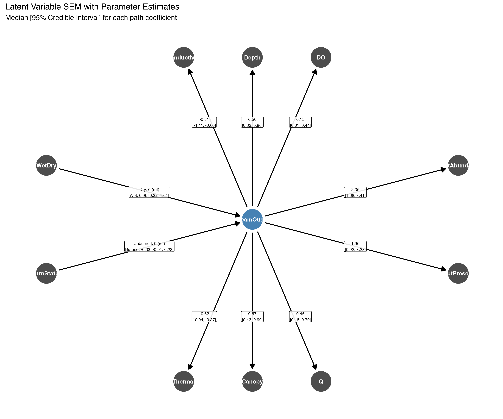
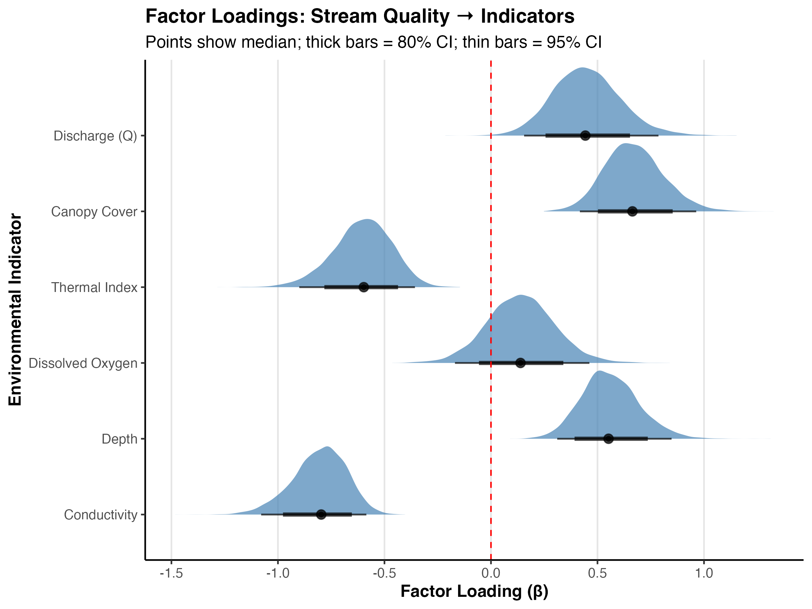
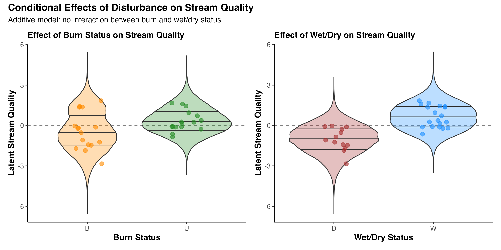
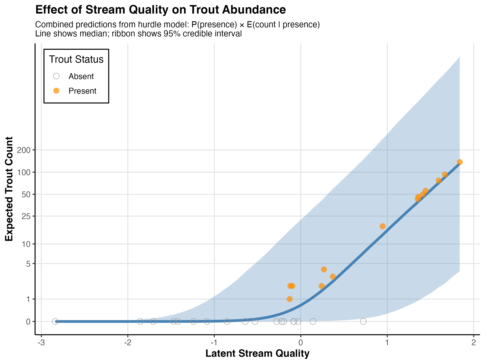
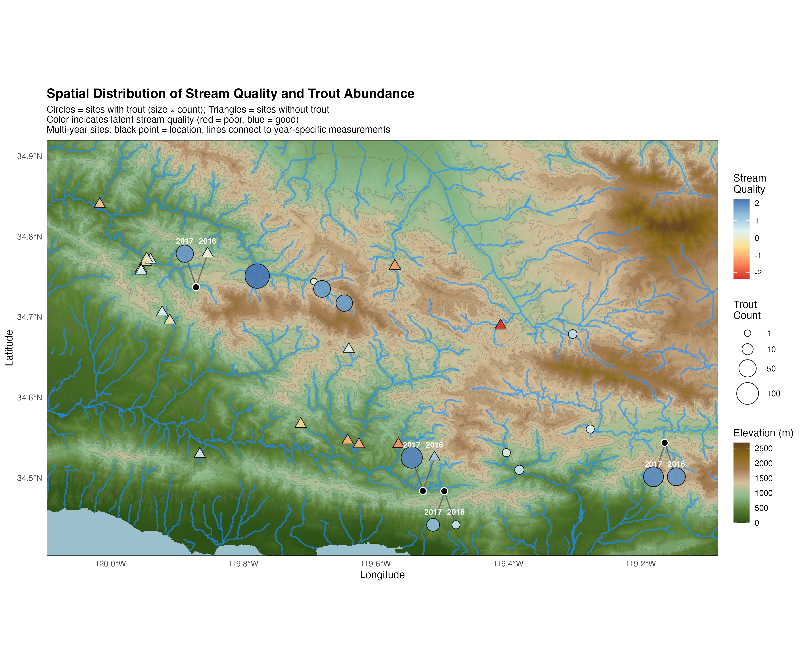
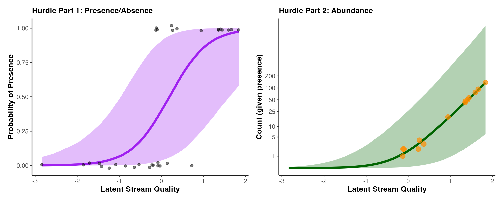
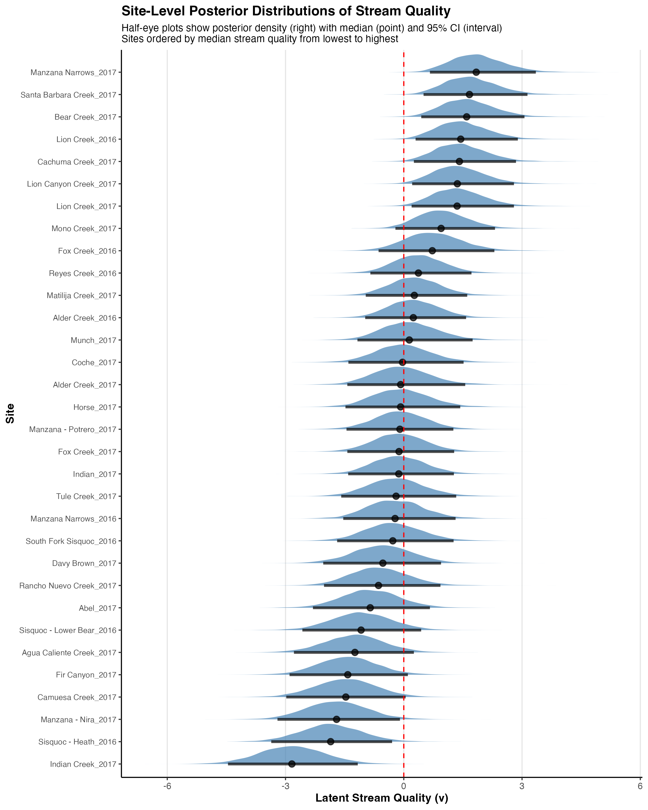

---
---
---

# Latent Variable Structural Equation Model: Stream Quality and Trout Abundance

## Model Overview

This document presents results from a Bayesian latent variable structural equation model (SEM) examining the relationships between wildfire disturbance, stream quality, environmental indicators, and trout abundance in Sierra Nevada streams.

------------------------------------------------------------------------

## Figure 1: Structural Equation Model Path Diagram

**Figure 1. Path diagram for the latent variable structural equation model.** The diagram shows the hypothesized causal relationships between predictors (Burned, Wet/Dry status), the latent stream quality variable (blue node), environmental indicators (Conductivity, Depth, Dissolved Oxygen, Thermal Index, Canopy Cover, Discharge), and trout outcomes (Presence and Abundance). Numbers along paths represent median posterior estimates with 95% credible intervals in brackets. Predictors (left) influence the unobserved latent stream quality variable (center), which in turn affects both environmental indicators (top and bottom) and trout population metrics (right). The model uses a hurdle structure for trout, separating presence/absence from abundance given presence. Positive coefficients indicate that increases in stream quality are associated with increases in the indicator or outcome; negative coefficients indicate the opposite relationship.

------------------------------------------------------------------------

## Figure 2: Factor Loadings for Environmental Indicators

**Figure 2. Posterior distributions of factor loadings relating stream quality to environmental indicators.** Each panel shows the posterior density (blue distribution) for the effect of latent stream quality on each environmental indicator variable. Points indicate median estimates; thick horizontal bars represent 80% credible intervals; thin bars represent 95% credible intervals. The dashed vertical line at zero provides a reference for determining whether effects are credibly positive or negative. Conductivity and Thermal Index show negative loadings, indicating that higher stream quality is associated with lower conductivity and cooler temperatures. Depth, Dissolved Oxygen, Canopy Cover, and Discharge (Q) show positive loadings, suggesting these variables increase with stream quality. The magnitudes of the loadings indicate the strength of each indicator in reflecting the latent stream quality construct.

------------------------------------------------------------------------

## Figure 3: Effects of Disturbance on Latent Stream Quality

**Figure 3. Conditional effects of wildfire and drought on latent stream quality.** **(A)** Effect of burn status on stream quality, comparing burned (B, orange) to unburned (U, green) watersheds. **(B)** Effect of wet/dry status on stream quality, comparing wet (W, blue) to dry (D, brown) conditions. Each panel shows violin plots representing the full posterior distribution of stream quality estimates for all sites within each group, capturing both between-site variation and posterior uncertainty. Individual site median estimates are overlaid as jittered points. Horizontal lines within violins indicate quartiles (25th, 50th, 75th percentiles) of the pooled posterior distributions. The dashed horizontal line at zero represents the grand mean of stream quality. The model includes additive effects of both predictors with no interaction term. Results suggest that burned watersheds have lower stream quality than unburned watersheds, while wet conditions are associated with higher stream quality compared to dry conditions, with the effects being independent and additive. The violin widths reflect the combined uncertainty across all sites in each group.

------------------------------------------------------------------------

## Figure 4: Relationship Between Stream Quality and Trout Abundance

**Figure 4. Effect of latent stream quality on expected trout abundance.** Points represent observed trout counts (y-axis, log-scale) plotted against posterior median estimates of latent stream quality for each site (x-axis). Filled circles indicate sites where trout were present (count \> 0); open circles indicate sites where trout were absent (count = 0). Points are colored by presence/absence status (orange = present, gray = absent). The blue line shows the median predicted relationship from the hurdle model, calculated as the product of presence probability and expected abundance given presence: E[Count] = P(presence) × E(count \| presence). The shaded ribbon represents the 95% credible interval for predictions. The log-scale y-axis accounts for the wide range of trout counts and the zero-inflated nature of the data. The positive relationship demonstrates that higher stream quality is strongly associated with both increased probability of trout presence and greater abundance when present, with the combined effect showing substantial increases in expected trout counts across the range of observed stream quality values.

------------------------------------------------------------------------

## Figure 5: Spatial Distribution of Stream Quality and Trout

**Figure 5. Geographic distribution of stream quality and trout abundance across the study region.** Study sites are displayed on a topographic basemap with elevation indicated by color (green = low elevation, brown = high elevation) and contour lines showing elevation changes. Rivers and streams are shown in blue. Sites are represented as symbols scaled and colored by their ecological characteristics: filled circles indicate sites where trout were present, with circle size proportional to trout count; filled triangles indicate sites where trout were absent. Symbol fill color represents the posterior median estimate of latent stream quality, with a diverging color scale from red (poor quality, negative values) through yellow to blue (good quality, positive values). Black outlines around symbols improve visibility against the varied topographic background. For sites sampled in multiple years (2016 and 2017), a black point marks the actual sampling location, with gray lines connecting to year-specific measurements positioned at 45-degree angles from each other. Year labels are displayed in white above each measurement. This spatial visualization reveals geographic patterns in both stream quality and trout distribution, showing how environmental conditions and fish populations vary across the landscape, and allows assessment of spatial clustering, potential dispersal limitations, temporal changes, and relationships between topographic position and ecological state.

------------------------------------------------------------------------

## Supplementary Figure S1: Hurdle Model Components

**Supplementary Figure S1. Decomposition of trout response into hurdle model components.** **(A)** Effect of stream quality on probability of trout presence (binary outcome: present vs. absent). The purple line shows the logistic relationship with 95% credible interval (shaded region). Raw binary data (0 = absent, 1 = present) are shown with vertical jittering for visibility. **(B)** Effect of stream quality on trout abundance conditional on presence (zero-truncated Poisson model). The green line shows median predictions with 95% credible interval for expected count given that trout are present. Orange points show observed counts at sites where trout were detected (count \> 0 only). Y-axis is on log-scale to accommodate the range of counts. Together, these panels illustrate how stream quality influences both the occurrence and magnitude of trout populations, with both components showing strong positive relationships with stream quality.

------------------------------------------------------------------------

## Supplementary Figure S2: Site-Level Stream Quality Estimates

**Supplementary Figure S2. Site-specific posterior distributions of latent stream quality.** Each row shows a half-eye plot for an individual site, displaying the full posterior distribution (density curve on right), posterior median (point), and 95% credible interval (horizontal line). Sites are ordered vertically from lowest to highest median stream quality. The dashed vertical red line at zero represents the grand mean of stream quality across all sites. The width and shape of each density curve reflects the posterior uncertainty in the stream quality estimate for that site, with wider distributions indicating greater uncertainty. Site names are shown on the y-axis. This figure provides a comprehensive view of heterogeneity in stream quality across the study region, showing both the rank ordering of sites and the degree of certainty in each site's estimated quality. Sites with stream quality estimates substantially below zero have below-average environmental conditions, while sites above zero have above-average conditions.

------------------------------------------------------------------------

## Statistical Notes

-   All models were fit using Bayesian methods via Stan with 4 MCMC chains, 2000 warmup iterations, and 2000 sampling iterations per chain.
-   Convergence was assessed via R̂ statistics (all \< 1.01) and visual inspection of trace plots.
-   Factor loadings for Depth were constrained to be positive for model identification.
-   Trout abundance effect (beta_trout_abundance) was constrained to be positive for model identification in the hurdle abundance component.
-   Environmental indicators were standardized (z-scored) prior to modeling.
-   The latent stream quality variable is modeled as a linear combination of an intercept, burn, and wet/dry predictors plus residual variation.
-   All credible intervals are 95% unless otherwise noted.
-   Priors: Stream quality intercept ~ N(0,10); burn and wet effects ~ N(0,0.5); factor loadings ~ N(0,2) or Exp(1.8) for constrained parameters; residual SDs ~ Exp(2); hurdle parameters ~ N(0,2) or Exp(1).

------------------------------------------------------------------------

*Generated from Stan model: `stan_model_full_hurdle_wintercept_v2_fit.rds`*
